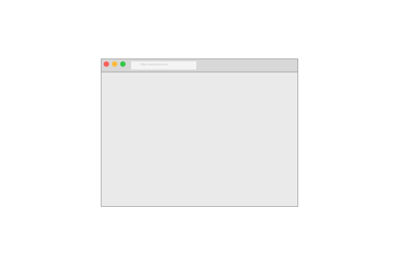
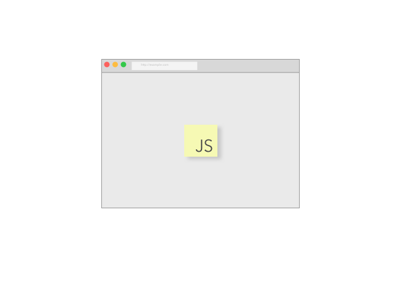
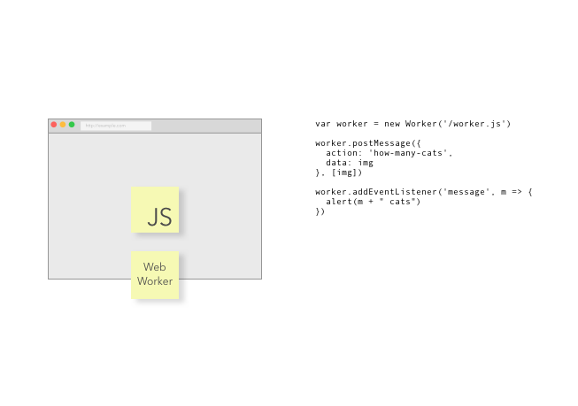
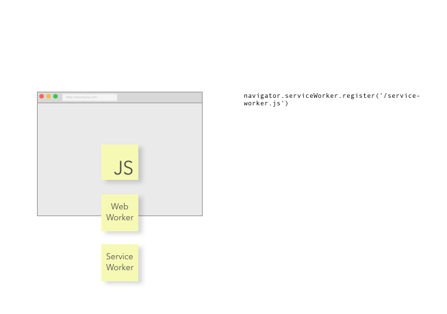
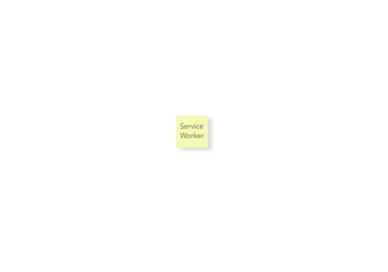

# Service Workers
## For Party goers

---

# I'm Ben

---

# Pusher

## We make it easy to add realtime functionality to your sites/apps

### ex. Connecting small buttons to slide decks


---

# JSOxford

---

# Web development:

### Backend - _Responding to http requests_

### Frontend - _Making http requests_


<!--

# JSOxford

---

# JSOxford :boom: PHPOxford

---

# JSOxford ❤️ PHPOxford

---

> We’re excited to be joining forces with @JSOxford for this month’s meetup. No left-pad jokes, people 🙂

- @phpoxford

-->

---

# Webpages

---



---



---



---



---



^ It doesn't require a page to be loaded
^ It doesn't require access to a server


---

### [fit] Service workers: kind of a backend thing

* no direct access to ui
* _responds to http requests_

<!--

---

## Javascript

* single threaded
* shares UI thread

---

## WebWorkers

```js
var worker = new Worker('/worker.js')

worker.postMessage({action: 'how-many-cats', data: img}, [img])
worker.addEventListener('message', m => {
  alert(m + " cats")
})
```

---

## ServiceWorkers

```js
navigator.serviceWorker.register('/service-worker.js')
```

-->

---

# ~

---

## Network Proxy / Cache

^ **Before** page opens

^ Offline support

^ Advanced caching strategies - if you request a, request and cache b, c, d

^ custom cache warming when a user logs in.

^ A user logs out, we can expire all the content

---

## Background Sync

^ **After** page closes

---

## Periodic background sync

^ **Without the page even being there**

^ request this data sometime when the user is on wifi

---

## Push notifications

^ homescreen notifications - allows new way of interacting with users

---

# …Or, not

^ Perfect example of progressive enhancement - because it's intercepting requests, non-supporting browsers just defer to working like normal

---

# ~

---

# Where's the party at?

---

## [FRONTEND PARTY?]

---

## Once registered, our frontend code doesn't have to know a Service Worker exists

^ progressive enhancement


---

## [LET'S ALL PARTY TOGETHER]

<!-- ---
* react / angular / jquery / gulp / grunt / brocolli-less
* It can be challenging
* It opens up new things to do -->


---

# Thanks, I'm

# [fit] Ben Foxall

### @benjaminbenben

### @pusher
